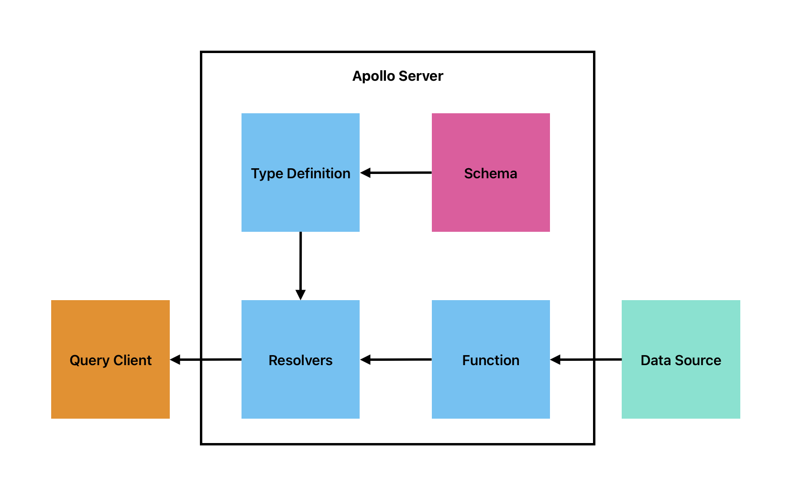

# graphql-apollo-server
GraphQL beginner-friendly demonstration using Apollo Server.

## 🧱 System Architecture


## 💡 General Idea
```index.js``` file contains all the operation codes and ```dataset.js``` have sample data.

**Type Definitions** are like blueprints in GraphQL. They describe all the available models and their properties, much like how TypeScript defines data types.

**Schema** acts as a strict rulebook in GraphQL. It lists all the available properties, including their data types, for each declared data model.

**Resolvers** are the doers in GraphQL. They're functions that handle both fetching data and making changes, depending on how they're connected to the data source.

**Functions** are the bridge between what the client wants and where the data lives. They handle getting data from the client's query and making changes in the data source.

**Data Sources** can be databases, message brokers, or third-party APIs that give you data. They're closely linked to the functions that sort out the data based on the query.

## 🕹️ Uses of GraphQL in your project
1. **Efficient Data Fetching**: GraphQL allows clients to request only the data they need, reducing over-fetching and under-fetching of data, which is common in REST APIs. This efficiency in data fetching is particularly advantageous in mobile applications and areas with limited bandwidth.

2. **Single Endpoint for Queries**: Unlike REST APIs that often require multiple endpoints for different data needs, GraphQL typically uses a single endpoint, simplifying the overall architecture and making it easier for clients to request the exact data they require.

3. **Flexible Schema and Strong Typing**: GraphQL's schema defines a contract between the client and server, providing flexibility for the client to request specific data while maintaining strong typing. This flexibility is especially useful in scenarios where the data requirements change frequently.

4. **Supports Real-Time Data**: With subscriptions, GraphQL allows real-time updates. This is invaluable for applications that need to display live data, such as chat apps, live feeds, or collaborative editing environments.
Aggregation of Multiple Data Sources: GraphQL can aggregate data from multiple sources like databases, microservices, or third-party APIs, presenting a unified interface for accessing this data.

5. **Development Efficiency**: GraphQL's self-documenting nature simplifies the development process. It enables developers to understand the API structure quickly and facilitates easier collaboration between front-end and back-end teams.
**Caching**: GraphQL's ability to specify precisely what data is needed can improve caching efficiency, as clients can request only the specific data that has changed, reducing unnecessary network requests.

6. **Versionless API**: With GraphQL, clients can request exactly what they need without reliance on specific API versions. This reduces the need for maintaining multiple versions of APIs, simplifying the evolution of the API over time.
Supports Batched Queries: GraphQL allows clients to send multiple queries in a single request, reducing network overhead and improving performance.

7. **Mobile Applications**: GraphQL's ability to tailor data requests to match the precise needs of mobile applications can significantly reduce data usage and improve app performance, crucial factors in mobile development.
Overall, GraphQL's flexibility, efficiency, and ability to cater to the specific needs of diverse applications make it a powerful choice for many use cases across different industries.